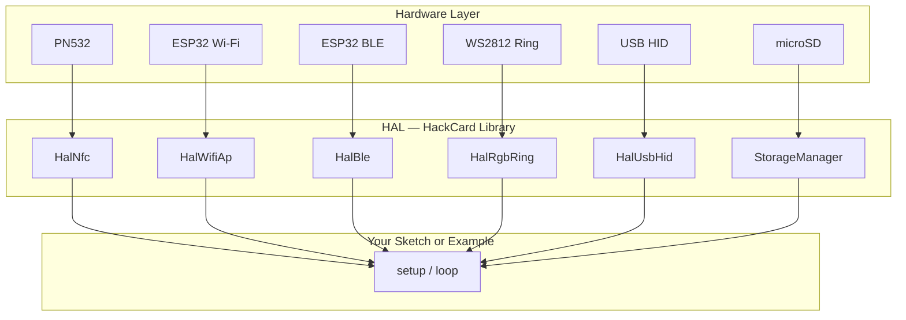

# Features

HackCard combines multiple security-lab peripherals on a single credit-card PCB. Each feature has dedicated HAL code, example sketches, and tutorials.

---

## Feature map

| Feature | Hardware | Example tutorials |
|---------|----------|-------------------|
| [NFC / RFID](nfc.md) | PN532 + PCB antenna coil | Read UID, Write URL, Dump, Clone |
| [Wi-Fi Lab](wifi.md) | ESP32-S3 2.4 GHz | AP, Scan, Captive portal, Beacon |
| [Bluetooth LE](ble.md) | On-chip BLE 5 | Scan, Advertise, Contact card |
| [RGB & Buzzer](rgb-and-buzzer.md) | 12× WS2812 + piezo | Ring patterns, status feedback |
| [USB HID](usb-hid.md) | TinyUSB composite | Keyboard, mouse, media keys |
| [SD Storage](storage.md) | SPI microSD | Logs, NFC dumps, config JSON |

---

## Architecture

Each feature is accessible independently — use one or combine many in your custom firmware.

---

## Operating modes

| Mode | Trigger | Storage |
|------|---------|---------|
| **Flash Mode** | No SD card | LittleFS + compiled defaults |
| **Full Mode** | SD inserted | SD preferred, auto folder setup |

---

## Lab features

Some capabilities are intended for **authorized testing only**:

- NFC clone / kill
- Wi-Fi evil twin simulation
- Probe sniff / deauth demo
- USB HID payload injection

See [Legal & Ethical Use](../resources/legal-ethical-use.md) before using lab features.
