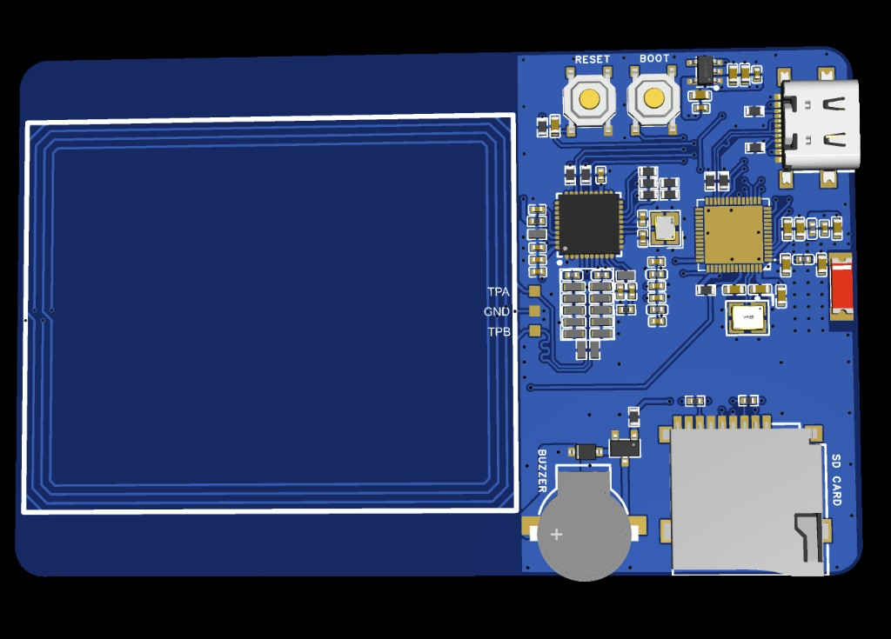

# NFC Hardware

HackCard includes a **PN532 NFC controller** with a PCB-integrated antenna coil.

**Reader, not emulator:** The PN532 operates as an **NFC reader/writer** for external ISO14443 tags. HackCard **does not emulate** NFC tags or cards. A phone cannot tap HackCard as a contactless payment or access card.

---

## Physical layout

Tap external NFC tags on the **back** of the PCB, over the rectangular antenna coil:

<figure class="hardware-image" markdown="1">

<figcaption>NFC antenna coil — left side of back PCB</figcaption>
</figure>

---

## Electrical connection

| Signal | GPIO | Value |
|--------|------|-------|
| SDA | 8 | I2C data |
| SCL | 18 | I2C clock |
| IRQ | 17 | Interrupt |
| Address | — | `0x24` |

---

## Supported operations (firmware)

From `app_registry.h` and `HalNfc.h`:

| App flag | Capability |
|----------|------------|
| `APP_NFC_READ` | Read UID |
| `APP_NFC_INFO` | Tag family + NDEF preview |
| `APP_NFC_DUMP` | Type 2 page dump |
| `APP_NFC_WRITE` | NDEF URL/text/vCard write |
| `APP_NFC_CLONE` | Type 2 restore (lab) |
| `APP_NFC_KILL` | Permanently lock Type 2 (lab) |
| `APP_NFC_CLASSIC` | Mifare Classic dump/clone/keyscan (lab) |

All operations interact with **external physical tags** — not phone emulation.

---

## Libraries

| Library | Purpose |
|---------|---------|
| Adafruit PN532 | NFC controller driver |
| Adafruit BusIO | I2C dependency |

---

## Source

- [`src/platform/hal/HalNfc.h`](https://github.com/hardwarehackspace/HackCard-ESP32)
- [`config/board_config.h`](https://github.com/hardwarehackspace/HackCard-ESP32/blob/main/config/board_config.h)
