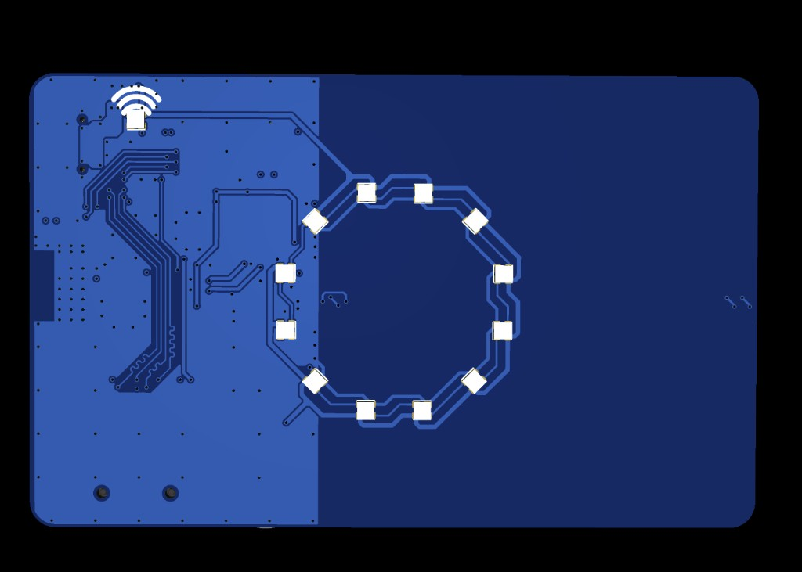

# HackCard ESP32

Credit-card sized ESP32-S3 security lab hardware for backers and developers.

FW v0.21.2

[Getting Started :octicons-arrow-right-24:](getting-started/introduction.md){ .md-button .md-button--primary }
[Pinout :octicons-arrow-right-24:](hardware/pinout.md){ .md-button }

**NFC clarification:** HackCard includes a **PN532 NFC reader**. It reads and writes external NFC tags/cards. HackCard does **not** emulate NFC tags or cards — your phone cannot tap HackCard as if it were a contactless card.

---

## Backer quick path

<ol class="backer-path" markdown="1">

<li>**[What is HackCard?](getting-started/introduction.md)** — hardware overview</li>
<li>**[What's included](getting-started/whats-included.md)** — board, ports, peripherals</li>
<li>**[Hardware version](getting-started/hardware-versions.md)** — identify your board</li>
<li>**[First setup](getting-started/first-setup.md)** — connect USB, install tools</li>
<li>**[First program](getting-started/first-program.md)** — upload firmware</li>
<li>**[Features](features/nfc-reader.md)** — NFC, Wi-Fi, RGB, buzzer, SD</li>
<li>**[Firmware download](resources/firmware.md)** — source code repository</li>
<li>**[Troubleshooting](troubleshooting.md)** — if something fails</li>

</ol>

<figure class="hardware-image" markdown="1">

<figcaption>Front — Wi-Fi LED, 12-LED RGB ring</figcaption>
</figure>

<figure class="hardware-image" markdown="1">

<figcaption>Back — NFC antenna coil, ESP32-S3, USB-C, SD slot</figcaption>
</figure>

---

## Verified specifications

| Spec | Value | Source |
|------|-------|--------|
| Board | HackCard ESP32-S3 | `config/board_config.h` |
| MCU | ESP32-S3FH4R2 | `config/board_config.h` |
| Flash | 4 MB | `config/board_config.h` |
| PSRAM | 2 MB (OPI) | `config/board_config.h` |
| Firmware | v0.21.2 | `FIRMWARE_VERSION` |
| NFC | PN532 reader (I2C) | `config/board_config.h` |
| Wi-Fi | 2.4 GHz only | `config/user_config.h` |

---

## Documentation sections

- :material-rocket-launch-outline:{ .lg .middle } **Getting Started**

    ---

    Unbox → setup → first upload

    [:octicons-arrow-right-24: Start](getting-started/introduction.md)

- :material-chip:{ .lg .middle } **Hardware**

    ---

    Pinout, ESP32, NFC, SD, power

    [:octicons-arrow-right-24: Hardware](hardware/overview.md)

- :material-download-outline:{ .lg .middle } **Software**

    ---

    Arduino IDE, libraries, firmware

    [:octicons-arrow-right-24: Software](software/installation.md)

- :material-book-open-variant:{ .lg .middle } **Tutorials**

    ---

    Step-by-step guides by topic

    [:octicons-arrow-right-24: Tutorials](tutorials/beginner.md)

