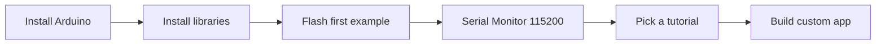

# HackCard ESP32

Pocket-sized ESP32-S3 security lab hardware — NFC, Wi-Fi, BLE, RGB, and USB HID in a credit-card form factor.

[Get Started :octicons-arrow-right-24:](getting-started/index.md){ .md-button .md-button--primary }
[View Pinout :octicons-arrow-right-24:](pinout/index.md){ .md-button }

## Overview

HackCard is a custom **ESP32-S3FH4R2** PCB designed for hands-on security research and embedded development. Firmware ships as an **Arduino library with example sketches** — flash, learn, and build your own applications.

<figure class="hardware-image" markdown="1">

<figcaption>Front render — Wi-Fi status LED, 12-LED RGB ring, NFC tap zone</figcaption>
</figure>

<figure class="hardware-image" markdown="1">

<figcaption>Back PCB — NFC antenna coil, ESP32-S3, USB-C, SD card, buzzer</figcaption>
</figure>

---

## Specifications

| Spec | Value |
|------|-------|
| MCU | ESP32-S3FH4R2 |
| Flash | 4 MB |
| PSRAM | 2 MB (OPI) |
| Wireless | Wi-Fi 2.4 GHz + BLE 5 |
| NFC | PN532 (ISO14443) |
| LEDs | 12× WS2812 ring + 1× status |
| Audio | Piezo buzzer |
| Storage | microSD (SPI, optional) |
| USB | USB-C (CDC + HID) |
| Firmware | `v0.21.2` |

---

## Documentation sections

-   :material-rocket-launch-outline:{ .lg .middle } **Getting Started**

    ---

    Install Arduino IDE, board settings, and flash your first sketch.

    [:octicons-arrow-right-24: Start here](getting-started/index.md)

-   :material-chip:{ .lg .middle } **Features**

    ---

    NFC, Wi-Fi lab, BLE, RGB ring, USB HID, and SD storage.

    [:octicons-arrow-right-24: Explore features](features/index.md)

-   :material-school-outline:{ .lg .middle } **Tutorials**

    ---

    Step-by-step guides with code, photos, and expected output.

    [:octicons-arrow-right-24: Browse tutorials](tutorials/index.md)

-   :material-code-braces:{ .lg .middle } **Software**

    ---

    Library structure, example sketches, config, and partitions.

    [:octicons-arrow-right-24: Software docs](software/index.md)

-   :material-map-outline:{ .lg .middle } **Pinout**

    ---

    GPIO reference and board layout with hardware photos.

    [:octicons-arrow-right-24: View pinout](pinout/index.md)

-   :material-wrench-outline:{ .lg .middle } **Troubleshooting**

    ---

    Upload errors, Wi-Fi, NFC, and Serial Monitor fixes.

    [:octicons-arrow-right-24: Fix issues](troubleshooting/index.md)

---

## Quick start path

!!! tip "New hardware photos coming"
    More real product photos will be added to the [Board Layout](pinout/board-layout.md) page as they become available.

---

## Source code

Firmware repository: **[HackCard-ESP32](https://github.com/hardwarehackspace/HackCard-ESP32)** on GitHub.
