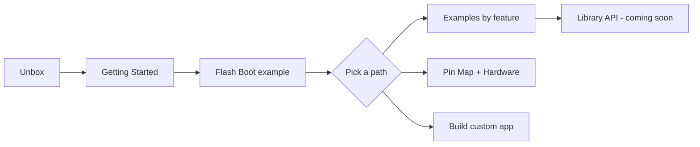

# HackCard ESP32 Documentation

Welcome to the official **HackCard ESP32** guide — your live, clickable manual for setup, hardware, example sketches, and development.

!!! tip "New to HackCard?"
    Start with **[Getting Started](getting-started.md)** — install Arduino IDE, flash your first example, and confirm Serial output in about 15 minutes.

---

## What is HackCard?

HackCard is a pocket-sized **ESP32-S3 security lab board** with:

| Feature | Hardware |
|---------|----------|
| **NFC** | PN532 (read, write, dump, clone lab) |
| **Wi-Fi** | AP mode, scan, captive portal, lab demos |
| **BLE** | Scan, advertise, contact card |
| **RGB** | 12-LED ring + Wi-Fi status LED |
| **USB HID** | Keyboard / mouse payloads to connected PC |
| **Storage** | microSD (optional) + onboard flash |

Firmware is delivered as an **Arduino library + example sketches** — you flash and build your own applications.

---

## Quick links

-   :material-rocket-launch-outline:{ .lg .middle } **Getting Started**

    ---

    Install tools, board settings, and flash your first sketch.

    [:octicons-arrow-right-24: Start here](getting-started.md)

-   :material-map-outline:{ .lg .middle } **Pin Map**

    ---

    GPIO reference for HackCard PCB.

    [:octicons-arrow-right-24: View pins](hardware/pin-map.md)

-   :material-code-braces:{ .lg .middle } **Examples**

    ---

    One sketch per feature — NFC, Wi-Fi, BLE, RGB, HID.

    [:octicons-arrow-right-24: Browse examples](examples/index.md)

-   :material-wrench-outline:{ .lg .middle } **Troubleshooting**

    ---

    Upload errors, Wi-Fi issues, NFC not detected.

    [:octicons-arrow-right-24: Fix problems](troubleshooting.md)

---

## Documentation map

---

## Current firmware version

| Item | Value |
|------|-------|
| Version | `0.21.2` |
| MCU | ESP32-S3FH4R2 (4 MB flash, 2 MB PSRAM) |
| IDE | Arduino IDE 2.x + ESP32 board package |

---

## Need the source code?

Firmware and example sketches live in the **[HackCard-ESP32](https://github.com/hardwarehackspace/HackCard-ESP32)** repository on GitHub.

---

*This site is the product manual — always up to date, no PDF required.*
