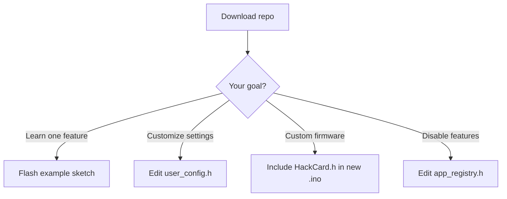

# Software

HackCard firmware is delivered as an **Arduino library + example sketches**. This section covers the codebase structure, configuration, and how to build custom applications.

---

## Delivery model

| Component | Location | Purpose |
|-----------|----------|---------|
| **HackCard library** | `libraries/HackCard/` | HAL + feature APIs |
| **Example sketches** | `libraries/HackCard/examples/` | One `.ino` per function |
| **Full firmware** | `HackCard_ESP32/` | Reference monolith (optional) |
| **Config headers** | `config/` | Board pins + user settings |

---

## Repository structure

```
HackCard_ESP32/
├── HackCard_ESP32.ino       ← Reference firmware entry
├── config/
│   ├── board_config.h       ← Pin map (do not change unless custom PCB)
│   ├── user_config.h        ← Your name, AP, PINs
│   └── app_registry.h       ← Compile-time feature toggles
├── partitions.csv           ← Flash layout
└── src/
    ├── platform/hal/        ← Hardware abstraction
    ├── apps/                ← Feature modules
    └── core/                ← Config, storage, CLI
```

---

## Pages in this section

| Page | Content |
|------|---------|
| [Library Overview](library-overview.md) | HAL classes and architecture |
| [Example Sketches](example-sketches.md) | Full catalog of examples |
| [Configuration](configuration.md) | user_config.h and JSON config |
| [Partition Table](partition-table.md) | Flash / LittleFS layout |

---

## Build paths


